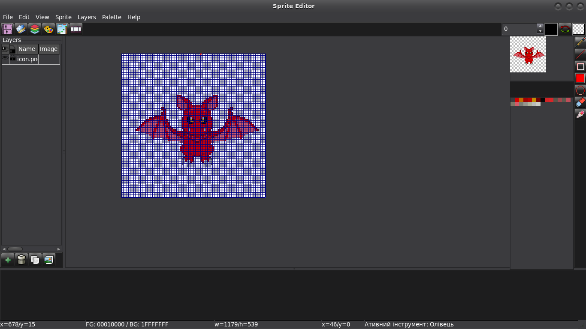
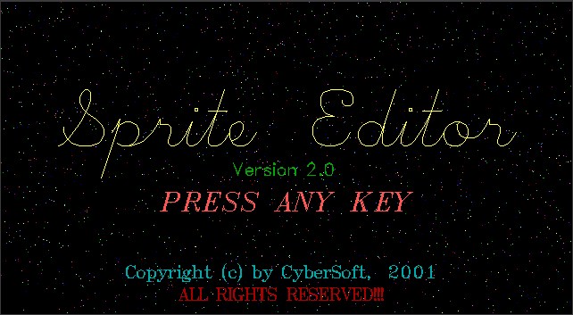

THIS DOCUMENT IN OTHER LANGUAGES
================================
[Українська](/doc/README%20uk.md)

[Brazilian Portuguese](/doc/README%20%20pt-BR.md)

WELCOME
=======
Welcome to Spedit 4.0, free and open source pixel-art editor and Sprite Library Manager for Windows/Linux (maybe MacOS X too - can't test it because i haven't Mac)

INTRODUCTION
============
Program written with Lazarus IDE/Free Pascal Compiler.
Simple but (maybe) powerful Sprite Editor and local sprite library for pixel-art based 2D games.

HOW TO GET
===========
When the editor is sufficiently ready for use (basic functions will be implemented, the program will work relatively stably), precompiled binaries will be available for download in the Releases section.

If you want to try to compile SPEdit from sources, you must have the Lazarus IDE with the Free Pascal Compiler installed on your operating system (it is recommended to use the latest stable builds). The latest stable version is usually available at [official site](https://lazarus-ide.org). In addition, the [BGRAControls](https://github.com/bgrabitmap/bgracontrols) package, from which individual components are used, must be additionally installed in the Lazarus environment.

You can then open the spedit.lpi project file in the Lazarus environment and compile and run it in the usual way for that environment.

WORK PROGRESS
=============
Still development, new features will be added when i have enought time and motivation.
You can sponsor me throught https://www.buymeacoffee.com/iso4free if You wanna get some features done faster.

LOCALIZATION
============
SPEdit supports localization of the interface to different languages. Interface translation files have the standard PO (Portable Object) format and must have names in the format spedit.xx.po or spedit.xx_XX.po, where xx or xx_XX is the common language identifier (e.g. spedit.pt_BR.po for Brazilian Portuguese). After selecting the interface translation file, localization occurs immediately without restarting the program and will be activated automatically at the next start.

If you want to see SPEdit localized to your language, you can contribute to the translation [here](https://crwd.in/spedit).

SHORT DOCUMENTATION
===================
For now, use arrow keys for moving on-grid cursor, Space and Enter keys to draw use selected colors (primary and secondary), Del key to clear pixel (DOS version style). Or just use the mouse like in any image editor.

In Tools window select primary and secondary color, select tool for mouse drawing and change pen size. Pencil and Line are currently available for drawing.

You can select primary and secondary colors click on any color in palette with left (primary) or right (secondary) mouse buttons.

Also You can select any color just clickin' on primary or secondary colors with left button or set it to transparent clickin' by right mouse button.

To swap colors, press X key or click on middle button (with red and green circled arrows) between primary and secondary colors.

To manage palette, You can import it from palette file in HEX format (more formats will be added in future) or import from image file. For now, palette limited 256 indexed colors only, but in future this limits may be cancelled.

To reset palette to default colors just use menu 'Palette>Reset palette'.

You can export palette in HEX format to use it for any purpose.

Hold Ctrl and use mouse scroll up/down to scale grid size.

Hold Alt and use mouse scroll to change background checkers size.

Hold mouse scroll to drag drawable area.

For show/hide preview window press F7 or check menu 'View>Tool panels>Preview'

Click to 'Preview' image for export in PNG file format.

For show referense image check menu 'View>Tool panels>Referense'.

Click to 'Referense' window to open any image used as reference.

You can add and remove layers in the layer window, the active layer name is highlighted in red. It is also possible to toggle the visibility of a layer by clicking on the eye icon opposite the layer name. The icon with a lock allows you to lock a layer from changes (will be used when sharing layers between different frames).

THE FUTURE
==========
In future will be avaliable:
- mouse drawing using different draw tools
- multi-frames and multi-layers for drawing
- shift and rotate layers and frames
- animations composer from any frames
- import other image files and copy parts from it to own image
- frame resize
- export in own JSON file format
- manage local sprite library with some useful search by hashtags
- other features that will be needed
- interface localization to other languages (done)

TROUBLESHOOTING
===============
- [+] In Windows keys won't work (fixed)
- [+] In Windows works very slow (fixed)
- [+] Sometime memory leaks happens (fixed)

COPYRIGHT
=========

Copyright (C) 2001-now Vadim Vitomsky

This program may be used freely, and you are welcome to redistribute it under certain conditions.

This program is distributed in the hope that it will be useful, but WITHOUT ANY WARRANTY; without even the implied warranty of MERCHANTABILITY or FITNESS FOR A PARTICULAR PURPOSE.  See the Spedit License Agreement for more details.

You should have received a copy of the GNU GENERAL PUBLIC LICENSE V.3 with this program; see the file [LICENSE](LICENSE). If not, visit the Spedit
home page.

Share and enjoy!

   Vadim Vitomsky
   iso4free@gmail.com

Feel free to contact me if you have commercial offers or interesting job offers.

HISTORY
=======

In early 2000 when I just done my first steps in programming with Turbo Pascal i want to make games.
For this time I did haven't acces to Internet, I even haven't PC!
But I wanted to become a professional programmer and continued to study programming from a book.

All games use some images and I decide make my own image editor at first just 'for fun' and programming practice.
First, I thought about what functionality I could implement based on the knowledge I had at the time.
After that, I came up with the concept of a graphical user interface, which I drew schematically in a regular notebook
and in the same notebook I began to write the code with a pen for the implementation of individual fragments of the future editor.
Since the images of characters in games are called sprites, the name of the editor was determined as Sprite Editor or Spedit.
According to his capabilities, he could very little - edit a fragment of the main image pixel by pixel in an
enlarged form. Only 16 colors were used in the palette. A custom file format was used to store the sprites.
 When starting, you had to enter the name of the file to be edited in the command line, after that a splash screen
 appeared with the name of the program on the background of the starry sky. After pressing any key, the user
 interface appeared. It was ugly and impractical but working! For now, unfortunately, source code was lost.

 Next version 2.0 was made a year after. Differense with previous version was PCX file format support.
 It was still useless. Sources and executable can be found in 'archive/spedit 2.0' directory.

 Two years later I tried to port SPEDit from Turbo Pascal to Free Pascal Compiler and compile for Windows.
 There was some changes in UI and support 256 colors palette but no mouse support.
 Interface language was changed from Russian to English. So it still was impractical.
 Sources also avaliasble in the 'archive/spedit 3.0' directory.

For now I decided to create a new version of SPEDit from scratch using CodeTyphon IDE with lot of functionality.
This version get number 4.

But I was curious to port old Turbo Pascal code and run it on modern Linux and Windows and decide try to do it.
To my surprise it not was hard - i just replace units CRT and GRAPH with ptccrt and ptcgraph and also make some minor code changes.
Voila! Now it compiled and run! So now you can run the native version under your operating system and try to draw pixel art using only the keyboard and 16 colors, just like the DOS days.
I created simple sprite format (text-based) in ported version, You can explore old Spedit sources for description.

Sure, it's old and ugly code, but it works! And this was my first serious program. So don't judge me harshly, I was just learning the basics of programming at the time. But if you run this old SPEdit, remember that you MUST specify the sprite file name on the command line (with or without any extension). If it is not specified, the file name "test.spr" will be used by default.

DEV.LOG
=======
[dev.log](/doc/devlog.md)